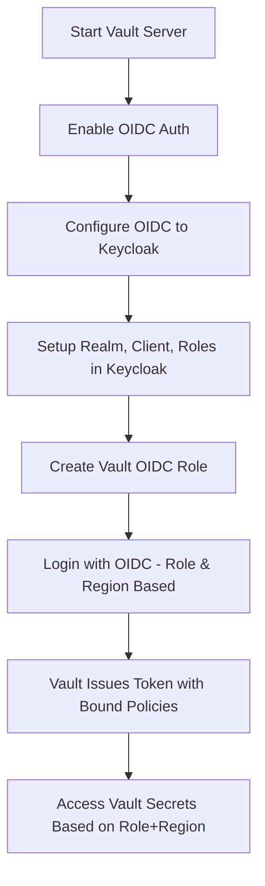

# 🔐 Vault OIDC Integration with Keycloak

This guide walks you through setting up Vault with Keycloak as an OIDC identity provider, including role-based access using Keycloak roles.

---

## 🧹 Step 1: Start Vault in Dev Mode (Docker)

```bash
docker run -d \
  --cap-add=IPC_LOCK \
  -e VAULT_DEV_ROOT_TOKEN_ID=myroot \
  -p 8200:8200 \
  --name vault-server \
  hashicorp/vault
```

---

## 🧹 Step 2: Set Environment Variable and Login

```bash
export VAULT_ADDR=http://localhost:8200
vault login myroot
```

> If Vault is running on a remote IP:

```bash
export VAULT_ADDR=http://192.168.1.114:8200
```

---

## 🧹 Step 3: Enable KV Secrets Engine

```bash
vault secrets enable -path=secret kv
vault kv put secret/demo password=123456
```

---

## 🧹 Step 4: Enable OIDC Authentication

```bash
vault auth enable oidc
```

Optionally, enable it under a custom path:

```bash
vault auth enable -path=keycloak oidc
```

---

## 🧹 Step 5: Configure OIDC with Keycloak

```bash
vault write auth/oidc/config \
  oidc_discovery_url="http://192.168.1.114:8080/realms/security-demo" \
  oidc_client_id="vault" \
  oidc_client_secret="" \   #  get from keycloak
  default_role="vault-role"
```

---

## 🧹 Step 6: Create OIDC Role in Vault (Role-Based Access)

```bash
vault write auth/oidc/role/vault-role \
  bound_audiences="vault" \
  allowed_redirect_uris="http://localhost:8250/oidc/callback" \
  user_claim="preferred_username" \
  groups_claim="roles" \
  bound_claims.roles=admin \
  policies="admin" \
  ttl="1h"
```

> Here you need to set up the role `admin` in the Keycloak client `vault`


## 🧹 Step 7: Add Region-Based Access Control (Optional)

### 🔹 Add a Region Attribute in Keycloak:

* Go to **Users** → Select a user → **Attributes**
* Add: `region = CA` or `region = US`

### 🔹 Create a Protocol Mapper in the `vault` Client:

* Name: `region`
* Mapper Type: `User Attribute`
* User Attribute: `region`
* Token Claim Name: `region`
* Claim JSON Type: `String`
* ✅ Add to ID/Access/UserInfo token

### 🔹 Create Region Policies in Vault:

```hcl
# canada-policy.hcl
path "secret/ca/*" {
  capabilities = ["read", "list"]
}

# us-policy.hcl
path "secret/us/*" {
  capabilities = ["read", "list"]
}
```

```bash
vault policy write canada vault/canada-policy.hcl
vault policy write us vault/us-policy.hcl
```

### 🔹 Create Region-Based Roles in Vault:

```bash
vault write auth/oidc/role/ca-role \
  bound_audiences="vault" \
  allowed_redirect_uris="http://localhost:8250/oidc/callback" \
  user_claim="preferred_username" \
  bound_claims.region="CA" \
  policies="canada" \
  ttl="1h"

vault write auth/oidc/role/us-role \
  bound_audiences="vault" \
  allowed_redirect_uris="http://localhost:8250/oidc/callback" \
  user_claim="preferred_username" \
  bound_claims.region="US" \
  policies="us" \
  ttl="1h"


  
```

---
Create OIDC Roles in Vault (Role + Region Based)

```bash

vault write auth/oidc/role/admin-us \
  bound_audiences="vault" \
  allowed_redirect_uris="http://localhost:8250/oidc/callback" \
  user_claim="preferred_username" \
  groups_claim="roles" \
  bound_claims.roles="admin" \
  bound_claims.region="US" \
  policies="admin,us" \
  ttl="1h"

vault write auth/oidc/role/user-us \
  bound_audiences="vault" \
  allowed_redirect_uris="http://localhost:8250/oidc/callback" \
  user_claim="preferred_username" \
  groups_claim="roles" \
  bound_claims.roles="user" \
  bound_claims.region="US" \
  policies="user,us" \
  ttl="1h"

vault write auth/oidc/role/admin-ca \
  bound_audiences="vault" \
  allowed_redirect_uris="http://localhost:8250/oidc/callback" \
  user_claim="preferred_username" \
  groups_claim="roles" \
  bound_claims.roles="admin" \
  bound_claims.region="CA" \
  policies="admin,canada" \
  ttl="1h"

vault write auth/oidc/role/user-ca \
  bound_audiences="vault" \
  allowed_redirect_uris="http://localhost:8250/oidc/callback" \
  user_claim="preferred_username" \
  groups_claim="roles" \
  bound_claims.roles="user" \
  bound_claims.region="CA" \
  policies="user,canada" \
  ttl="1h"

```

---

## 🧹 Step 8: Configure Keycloak

### 🔹 Realm: `security-demo`

### 🔹 Client: `vault`

* **Access Type**: confidential
* **Valid Redirect URIs**:

  ```
  http://localhost:8250/oidc/callback
  http://192.168.1.114:8250/oidc/callback    // replace with your host IP
  ```

### 🔹 Role:

* Create Realm Roles named `admin`, `user`

### 🔹 User:

* Create users (e.g., `adminuser`, `regularuser`)
* Assign roles: `admin` or `user`
* Add an **Attribute**: `region = US` or `region = CA`

### 🔹 Mapper (Token Claim Mapping):

* **Name**: `roles`

* **Mapper Type**: `User Realm Role`

* **Token Claim Name**: `roles`

* **Claim JSON Type**: `String Array`

* ✅ Add to ID Token

* ✅ Add to Access Token

* ✅ Add to UserInfo

* **Name**: `region`

* **Mapper Type**: `User Attribute`

* **User Attribute**: `region`

* **Token Claim Name**: `region`

* **Claim JSON Type**: `String`

* ✅ Add to ID/Access/UserInfo token

---

## 🧹 Step 9: Create Vault Policies

### Example: `admin-policy.hcl`

```hcl
path "secret/*" {
  capabilities = ["create", "read", "update", "delete", "list"]
}
```

### Example: `user-policy.hcl`

```hcl
path "secret/data/demo" {
  capabilities = ["read"]
}
```

### Example: `canada-policy.hcl`

```hcl
path "secret/ca/*" {
  capabilities = ["read", "list"]
}
```

### Example: `us-policy.hcl`

```hcl
path "secret/us/*" {
  capabilities = ["read", "list"]
}
```

Apply the policies:

```bash
vault policy write admin vault/admin-policy.hcl
vault policy write user vault/user-policy.hcl
vault policy write canada vault/canada-policy.hcl
vault policy write us vault/us-policy.hcl
```

---

## 🧹 Step 9: Login via OIDC

```bash
vault login -method=oidc role=admin-us
```

Vault will prompt a URL. Copy it into your browser, log in using the appropriate Keycloak user.

---

## 🧹 Step 10: Verify Authentication

Check your token info:

```bash
vault token lookup
```

Access a secret:

```bash
vault kv get secret/demo
```

---

## ✅ Summary Flow



---

